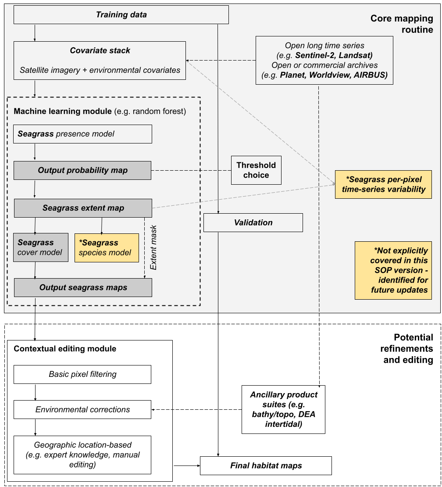

# Standard Operating Procedure for Seagrass Mapping using Optical Remote Sensing

*Version 1.0, March 2025*

## Table of Contents
1. [Introduction](#1-introduction)
2. [SOP Development](#2-sop-development)
3. [System Architecture](#3-system-architecture)
4. [Data Acquisition and Preparation](#4-data-acquisition-and-preparation)
5. [Training Data Collection and Curation](#5-training-data-collection-and-curation)
6. [Image Processing and Analysis](#6-image-processing-and-analysis)
7. [Classification and Modelling](#7-classification-and-modelling)
8. [Output Production and Validation](#8-output-production-and-validation)
9. [Post-processing and Refinement](#9-post-processing-and-refinement)
10. [Quality Control and Documentation](#10-quality-control-and-documentation)
11. [Conclusion and Future Directions](#11-conclusion-and-future-directions)
12. [SOP Maintenance](#12-sop-maintenance)
13. [Acknowledgements](#13-acknowledgements)
14. [References](#14-references)
15. [Appendices](#15-appendices)

## 1. Introduction

### 1.1 Purpose and Scope

This Standard Operating Procedure (SOP) provides comprehensive guidelines for mapping seagrass habitats using optical remote sensing techniques. It outlines standardized methodologies for data acquisition, processing, classification, validation, and quality control to ensure consistency, repeatability, and comparability across different mapping initiatives. While the primary focus is on using Sentinel-2 multitemporal imagery within the Google Earth Engine (GEE) platform, the SOP provides flexibility to accommodate alternative satellite sensors, computing environments, and specific project requirements.

### 1.2 Background

Seagrasses constitute one of the most important benthic habitats in coastal waters globally, providing numerous ecosystem services including nursery habitat, carbon sequestration, sediment stabilization, and water quality improvement. Accurate and up-to-date information on seagrass distribution, extent, and condition is essential for effective marine spatial planning, conservation management, and environmental monitoring.

Despite their ecological significance, many seagrass meadows remain unmapped or poorly documented, particularly in remote areas and subtidal environments. Spatial mapping data for seagrass is often lacking in many temperate coastal areas, especially for subtidal habitats in southern regions. Traditional field-based mapping approaches, while accurate, are resource-intensive and impractical for large-scale and repeated assessments.

Remote sensing technologies offer an effective solution for mapping seagrass at various spatial and temporal scales. Optical remote sensing, in particular, leverages the distinctive spectral signatures of seagrass to detect and delineate meadows from surrounding substrate types. Recent advancements in satellite sensor capabilities, cloud computing infrastructure, and machine learning algorithms have significantly enhanced our ability to map seagrass habitats efficiently and accurately.

### 1.3 Overview of Remote Sensing Approaches

Several optical remote sensing approaches can be employed for seagrass mapping, each with distinct advantages and limitations:

**Satellite-based multispectral imagery**: Platforms such as Sentinel-2, Landsat, and commercial satellites (e.g., Planet, WorldView) provide wide spatial coverage and regular revisit intervals, enabling large-scale and temporal monitoring. This SOP primarily focuses on Sentinel-2 imagery due to its optimal combination of spatial resolution (10m), spectral capabilities, global coverage, and free accessibility.

**Airborne multispectral/hyperspectral imagery**: These platforms offer higher spatial resolution but typically cover smaller areas and are acquired less frequently. They may be appropriate for detailed mapping of specific sites or as validation data.

**Drone-based imagery**: Unmanned aerial vehicles (UAVs) equipped with multispectral sensors can capture very high-resolution imagery of seagrass beds, but their application is limited to small spatial extents and is often influenced by environmental conditions.

The selection of an appropriate remote sensing approach depends on various factors, including the spatial scale of interest, required mapping accuracy, available resources, and specific project objectives.

## 2. SOP Development

### 2.1 Evolution of Seagrass Mapping Techniques

Remote sensing techniques for seagrass mapping have evolved considerably over the past decades, with significant methodological improvements driven by advances in sensor technology, computational capabilities, and analytical methods.

Early approaches relied primarily on visual interpretation of aerial photographs or simple classification of single-date satellite imagery. These methods, while valuable for establishing baseline distributions, were limited in their ability to distinguish seagrass from other aquatic vegetation and to account for temporal variability in seagrass coverage.

The development of more sophisticated multispectral sensors with improved spectral, spatial, and radiometric resolutions has enabled more accurate discrimination between seagrass and other benthos. Concurrently, the transition from pixel-based to object-based image analysis and the integration of contextual information has enhanced classification accuracy.

The emergence of machine learning algorithms, particularly random forests and boosted regression trees, has further improved mapping capabilities by better capturing complex relationships between environmental predictors and seagrass distribution. Most recently, the adoption of cloud-based computing platforms like Google Earth Engine has facilitated the processing of large volumes of satellite data, enabling multi-temporal analysis and near-real-time monitoring over vast geographic areas.

### 2.2 Current Best Practices

Based on extensive research and practical experience, several best practices have been identified for effective seagrass mapping using optical remote sensing:

- **Multi-temporal image analysis**: Using image stacks acquired over time rather than single-date imagery to minimize the influence of environmental factors (e.g., water clarity, sun glint) and capture seasonal variations in seagrass coverage.

- **Integration of environmental variables**: Incorporating relevant environmental parameters (e.g., bathymetry, wave exposure, substrate type) to improve classification accuracy and ecological relevance.

- **Hierarchical classification approaches**: Employing a staged classification process that first distinguishes broad habitat categories before refining to specific seagrass classes.

- **Robust validation procedures**: Implementing comprehensive accuracy assessment using independent field data and appropriate statistical metrics.

- **Contextual post-processing**: Applying knowledge-based rules and spatial filtering to refine classification outputs and eliminate implausible results.

This SOP incorporates these best practices while maintaining flexibility to accommodate specific project requirements and technological advancements.

### 2.3 Conceptual framework

Figure 1. shows the conceptual framework for technical and methodological components covered in this SOP.



### 2.4 Relationship to Other Protocols and real-world applications

This SOP builds upon and complements existing protocols for marine habitat mapping and seagrass monitoring. It aligns with internationally recognized standards and classification schemes, such as the Seamap Australia Benthic Classification Scheme, to ensure interoperability and consistency across different mapping initiatives.

While primarily focused on remote sensing methodologies, this SOP acknowledges the importance of field-based approaches and encourages their integration as complementary data sources. Reference is made to relevant field protocols where appropriate, particularly for the collection of training and validation data.  

This SOP is accompanied by a real-world application (Seagrass mapping in Tayaritja, Tasmania - Appendix X), and over time, other exmaples will be added.  

## 3. System Architecture

### 3.1 Remote Sensing Platforms and Sensors

#### 3.1.1 Satellite Platforms

Various satellite platforms can be utilized for seagrass mapping, with selection dependent on project requirements and resource availability:

**Sentinel-2 (Recommended Primary Platform)**
- Spatial Resolution: 10m (visible and NIR bands)
- Revisit Time: 5 days (with Sentinel-2A and 2B combined)
- Key Advantages: Free access, suitable spatial resolution, favorable spectral bands for aquatic vegetation, frequent revisits
- Limitations: May have limited utility in very turbid waters or for mapping small-scale features

**Landsat 8/9**
- Spatial Resolution: 30m (visible and NIR bands)
- Revisit Time: 16 days
- Key Advantages: Free access, long historical archive, good for large-scale assessments
- Limitations: Coarser spatial resolution limits detection of smaller seagrass patches

**Commercial High-Resolution Satellites (Planet, WorldView, SPOT, etc.)**
- Spatial Resolution: 0.3m to 5m
- Revisit Time: Daily to weekly (varies by platform)
- Key Advantages: Very high spatial resolution, suitable for detailed mapping
- Limitations: Costly acquisition, limited spectral bands, smaller footprint

#### 3.1.2 Sensor Considerations

For optimal seagrass mapping, sensors should ideally provide:
- High radiometric resolution to detect subtle reflectance variations in aquatic environments
- Key spectral bands in the visible spectrum (blue, green, red) for discriminating submerged vegetation
- Near-infrared bands for detecting exposed seagrass during low tide
- Suitable spatial resolution (≤10m) to identify seagrass meadows and patches
- Regular revisit intervals to enable multi-temporal analysis

Sentinel-2 Multi-Spectral Instrument (MSI) satisfies these requirements with its 13 spectral bands, 10m resolution for key bands, and 5-day revisit time, making it highly suitable for operational seagrass mapping.

### 3.2 Computing Resources and Software Environments

#### 3.2.1 Cloud Computing Platforms

**Google Earth Engine (GEE) (Primary Recommended Platform)**
- Advantages: Free access, extensive satellite imagery catalog, powerful distributed computing, integrated visualization tools, JavaScript and Python APIs
- Key Features: Efficient processing of large-scale imagery, built-in machine learning algorithms, ability to share and collaborate on code
- Considerations: Requires internet connectivity, limited to available GEE functions

**Digital Earth Australia (DEA)**
- Advantages: Australian-focused data cube, optimized for Australian conditions, Python-based open data cube environment
- Key Features: Analysis-ready data products, custom Australian algorithms
- Considerations: More complex setup than GEE, primarily focused on Australian region

**Other Options**: Microsoft Planetary Computer, Amazon Web Services (AWS) Earth on AWS, commercial remote sensing platforms

#### 3.2.2 Local Computing Environments

For projects with specific requirements or constraints, local computing environments may be preferred:
- Geographic Information Systems (GIS) software (e.g., ArcGIS, QGIS)
- Remote sensing software (e.g., ENVI, eCognition)
- Programming environments (e.g., Python, R) with relevant libraries

#### 3.2.3 Hardware Requirements

Hardware specifications depend on the selected software environment and data volume:
- Cloud platforms: Minimal local requirements (basic computer with internet connection)
- Local processing: High-performance computing resources (multi-core processors, sufficient RAM, dedicated GPU for machine learning)

### 3.3 Data Storage and Management

#### 3.3.1 Storage Considerations

Effective data management requires appropriate storage solutions:
- Cloud storage for large datasets (Google Cloud Storage, AWS S3, Microsoft Azure)
- Local storage systems with adequate capacity and backup mechanisms
- Institutional repositories for long-term archiving

#### 3.3.2 Data Organization

Standardized file naming conventions and directory structures are essential for efficient data management:
- Clear hierarchical organization (by region, date, processing level, etc.)
- Consistent file naming (including site, date, sensor, processing level)
- Separation of raw data, intermediate products, and final outputs

#### 3.3.3 Version Control

Implementation of version control for both data and code:
- Git repositories for code development and sharing
- Data versioning systems for tracking changes to datasets
- Comprehensive documentation of processing workflows and parameter settings

## 4. Data Acquisition and Preparation

### 4.1 Satellite Imagery Selection and Acquisition

#### 4.1.1 Imagery Selection Criteria

When selecting satellite imagery for seagrass mapping, consider the following factors:

**Spatial coverage**: Ensure complete coverage of the study area, accounting for potential tiling schemes and overlap requirements.

**Temporal window**: Select imagery from periods that maximize seagrass detectability (typically during low tide for intertidal areas and periods of high water clarity for subtidal regions). For multi-temporal analysis, define an appropriate time range to capture seasonal variations while maintaining ecological relevance.

**Cloud cover**: Prioritize cloud-free or low-cloud-cover images, especially over the areas of interest. For multi-temporal approaches, implement effective cloud masking procedures.

**Sea state conditions**: Select imagery acquired during calm conditions to minimize sun glint and water surface roughness.

**Water clarity**: Consider seasonal and spatial variations in water quality, prioritizing periods of higher clarity where possible.

#### 4.1.2 Sentinel-2 Imagery Acquisition

For Sentinel-2 imagery (recommended platform):

**Data access platforms**:
- Copernicus Open Access Hub (https://scihub.copernicus.eu/)
- Google Earth Engine data catalog
- Amazon Web Services (AWS) Sentinel-2 repository
- Digital Earth Australia (for Australian regions)

**Product levels**:
- Level-1C: Top-of-atmosphere reflectance, suitable when atmospheric correction will be performed as part of the workflow
- Level-2A: Surface reflectance (atmospherically corrected), recommended for most applications

**Collection version**:
- Use Collection 2 or later when available, as it offers improved geometric and radiometric accuracy compared to earlier collections

#### 4.1.3 Alternative Imagery Sources

**Landsat imagery**:
- Access via USGS Earth Explorer, Google Earth Engine, or AWS
- Prioritize Collection 2 Level-2 surface reflectance products

**Commercial high-resolution imagery**:
- Acquire through respective provider platforms (Planet Explorer, Maxar Direct Access, etc.)
- Request appropriate processing levels (orthorectified, atmospherically corrected)

### 4.2 Ancillary Data Sources

#### 4.2.1 Bathymetry and Topography

Bathymetric data is essential for seagrass mapping as it provides information on water depth, which influences light availability and seagrass distribution. Sources include:

- Airborne LiDAR-derived bathymetry (preferred where available)
- Multibeam or single-beam echo sounder surveys
- Satellite-derived bathymetry products
- National or regional bathymetric datasets (e.g., AusSeabed, Australian Hydrographic Office)

#### 4.2.2 Environmental Variables

Additional environmental datasets that may improve classification accuracy:

**Wave exposure data**:
- Wave hindcast models
- Fetch models
- Wave climate datasets

**Substrate information**:
- Sediment type maps
- Geomorphic classification datasets

**Water quality parameters**:
- Turbidity maps
- Chlorophyll-a concentration
- Light attenuation coefficients

#### 4.2.3 Existing Habitat Maps

Previously produced habitat maps can provide valuable context and training data:

- Historical seagrass maps
- Broad-scale benthic habitat classifications
- Coastal wetland inventories

### 4.3 Pre-processing and Data Cleaning

#### 4.3.1 Sentinel-2 Pre-processing

When using Google Earth Engine (GEE) for processing Sentinel-2 imagery:

**Filtering and selection**:
```javascript
// Example GEE code for filtering Sentinel-2 collection
var s2_collection = ee.ImageCollection("COPERNICUS/S2_SR")
  .filterBounds(studyArea)
  .filterDate(startDate, endDate)
  .filter(ee.Filter.lt("CLOUDY_PIXEL_PERCENTAGE", cloudThreshold));
```

**Cloud and shadow masking**:

There are other cloud masking options that will be detailed in `6. Image Processing and Analysis` as well as in the fully worked example in the appendix.  

```javascript
// Cloud masking function for Sentinel-2
function maskS2clouds(image) {
  var scl = image.select('SCL');
  var cloudMask = scl.neq(9).and(scl.neq(8)).and(scl.neq(7)).and(scl.neq(3));
  return image.updateMask(cloudMask);
}

// Apply cloud masking to collection
var s2_masked = s2_collection.map(maskS2clouds);
```

**Band selection**:
```javascript
// Select relevant bands for seagrass mapping
var bands = ['B2', 'B3', 'B4', 'B8'];
var s2_selected = s2_masked.select(bands);
```

#### 4.3.2 Geometric and Radiometric Corrections

These corrections are typically already applied in Sentinel-2 Level-2A products but may require additional processing for other imagery sources:

**Geometric corrections**:
- Ensure proper georeferencing and co-registration
- Apply terrain correction if necessary

**Radiometric corrections**:
- Atmospheric correction (if using Level-1C products)
- Sun glint removal for marine applications
- Water column correction for subtidal mapping

#### 4.3.3 Study Area Delineation

Define the appropriate study area boundaries to focus processing and reduce computational requirements:

**Land-water masking**:
```javascript
// Create land-water mask using global datasets
var landMask = ee.Image("MODIS/MOD44W/MOD44W_005_2000_02_24").select('water_mask');
```

**Depth limitation**:
```javascript
// Mask areas beyond mappable depth using bathymetry data
var bathymetry = ee.Image("GEBCO/2020/bathymetry").select('elevation');
var depthMask = bathymetry.gte(-15); // Limit to 15m depth
```

**Administrative or ecological boundaries**:
- Marine park boundaries
- Coastal management zones
- Biogeographic regions

## 5. Training Data Collection and Curation

### 5.1 Field Data Collection Protocols

#### 5.1.1 Sampling Design

A well-designed field sampling strategy is crucial for collecting representative training and validation data:

**Spatially balanced sampling**:
- Implement stratified random or systematic sampling designs
- Ensure coverage across environmental gradients (depth, exposure, substrate types)
- Target known or suspected seagrass areas and non-seagrass habitats
- Consider using established statistical packages (e.g., MBHdesign in R) for generating spatially balanced designs

**Sample size determination**:
- Aim for a minimum of 30-50 samples per habitat class
- Increase sample size for heterogeneous environments or when mapping multiple seagrass species
- Allow for approximately 70/30 split between training and validation datasets

#### 5.1.2 Field Methods

**Drop camera systems** (recommended for subtidal habitats):
- Benthic Observation Survey System (BOSS) or similar approaches
- Collect geo-referenced imagery of seafloor at predetermined sampling points
- Record metadata (date, time, depth, water conditions, etc.)

**Snorkel or SCUBA surveys**:
- Direct visual assessment using standardized quadrats or transects
- Suitable for detailed characterization of seagrass composition and condition
- Limited by diving constraints (depth, conditions, expertise)

**UAV surveys** (for intertidal areas):
- Low-altitude flights during low tide
- High-resolution multispectral imagery
- Ground control points for accurate georeferencing

**Boat-based observations**:
- Glass-bottom viewing buckets or towed video systems
- Track logs with annotated observations
- Suitable for rapid assessment of larger areas

### 5.2 Training Data Requirements

#### 5.2.1 Attribute Information

Essential attributes to record for each sampling point:

**Primary classification**:
- Presence/absence of seagrass
- Percentage cover (ideally in standardized classes: e.g., 0%, 1-10%, 11-40%, 41-70%, >70%)
- Dominant seagrass species (if species-level mapping is an objective)

**Secondary attributes**:
- Substrate type (sand, mud, rubble, etc.)
- Presence of other benthos (macroalgae, corals, etc.)
- Canopy height (where relevant)
- Seagrass condition assessment

**Environmental parameters**:
- Water depth
- Water clarity (e.g., Secchi depth)
- General habitat description

#### 5.2.2 Spatial Accuracy Requirements

To ensure proper alignment with satellite imagery:

**Positioning systems**:
- Differential GPS (≤5m accuracy) at minimum
- RTK GPS (≤1m accuracy) preferred for high-resolution mapping
- Accurate depth measurements (pressure sensors, sonar, or LiDAR)

**Spatial uncertainty documentation**:
- Record horizontal position accuracy for each point
- Document methodological limitations
- Consider spatial offset in shallow water due to boat positioning vs. camera position

#### 5.2.3 Temporal Considerations

Align field data collection with satellite imagery acquisition where possible:

- Prioritize field sampling within the same season as satellite imagery
- For multi-year studies, consider potential temporal changes in seagrass distribution
- Document phenological stage of seagrass at time of sampling

### 5.3 Data Validation and Quality Control

#### 5.3.1 Field Data Quality Assurance

Implement quality control measures during and after field data collection:

**Field verification**:
- Independent assessment by multiple observers
- Photographic documentation of sampling points
- Cross-validation with different sampling methods where possible

**Data cleaning procedures**:
- Identify and flag outliers or inconsistent observations
- Verify spatial coordinates and depth measurements
- Check for logical inconsistencies in attribute data

#### 5.3.2 Integration with Existing Knowledge

Enhance field data with contextual information:

**Expert knowledge incorporation**:
- Review by local experts familiar with the study area
- Integration of traditional ecological knowledge where appropriate
- Comparison with previous surveys or monitoring data

**Historical context**:
- Review of historical seagrass distribution patterns
- Assessment of recent disturbance events that might affect distribution
- Documentation of known seasonal or interannual dynamics

#### 5.3.3 Training Dataset Preparation

Format and organize field data for integration with remote sensing analysis:

**Data formatting**:
- Conversion to compatible spatial formats (GeoJSON, Shapefile, etc.)
- Standardization of attribute information
- Clear documentation of data structure and attribute definitions

**Stratification for model training**:
- Ensure balanced representation of habitat classes
- Account for depth gradients in sampling distribution
- Consider spatial autocorrelation in sampling design

## 6. Image Processing and Analysis

### 6.1 Multi-temporal Stack Creation

#### 6.1.1 Temporal Window Selection

Define an appropriate time period for creating multi-temporal image stacks:

**Annual composites**:
- Full year coverage to capture seasonal variations
- Suitable for assessing persistent seagrass meadows
- May obscure seasonal dynamics

**Seasonal composites**:
- Season-specific stacks (e.g., summer, winter)
- Suitable for capturing phenological variations
- Requires sufficient cloud-free imagery within each season

**Custom time periods**:
- Based on specific ecological considerations
- Targeted to coincide with field data collection
- Defined to minimize environmental interference (e.g., low turbidity periods)

#### 6.1.2 Pixel-Level Filtering

Implement filtering strategies to improve the quality of multi-temporal stacks:

**Cloud and shadow removal**:
```javascript
// GEE example for masking clouds in Sentinel-2 time series
function maskS2clouds(image) {
  var scl = image.select('SCL');
  var cloudMask = scl.lt(7).and(scl.gt(3));  // Values 4, 5, 6 are valid pixels
  return image.updateMask(cloudMask);
}
```

**Water depth filtering**:
```javascript
// GEE example for filtering pixels based on depth
function maskDepth(image) {
  return image.updateMask(bathymetry.gt(-20));  // Mask areas deeper than 20m
}
```

**Turbidity filtering**:
- Apply thresholds to remove highly turbid scenes
- Use water quality indices to identify and exclude compromised pixels

#### 6.1.3 Statistical Compositing

Calculate statistical summaries across the temporal dimension:

**Percentile composites**:
```javascript
// GEE example for creating percentile composites
var p20 = filteredCollection.reduce(ee.Reducer.percentile([20]));
var p50 = filteredCollection.reduce(ee.Reducer.percentile([50]));  // Median
var p80 = filteredCollection.reduce(ee.Reducer.percentile([80]));
```

**Temporal variance measures**:
```javascript
// Calculate standard deviation across time series
var stdDev = filteredCollection.reduce(ee.Reducer.stdDev());
```

**Interval means**:
```javascript
// Calculate interval mean (e.g., 20th-50th percentile mean)
var intervalMean = filteredCollection.reduce(ee.Reducer.intervalMean(20, 50));
```

### 6.2 Cloud Masking and Atmospheric Correction

#### 6.2.1 Cloud and Shadow Detection

Apply robust methods for identifying and masking clouds and their shadows:

**Sentinel-2 Scene Classification Layer (SCL)**:
```javascript
// Utilize SCL band to mask clouds and shadows
function maskClouds(image) {
  var scl = image.select('SCL');
  var validPixels = scl.neq(3).and(scl.neq(7)).and(scl.neq(8)).and(scl.neq(9)).and(scl.neq(10));
  return image.updateMask(validPixels);
}
```

**Cloud probability layer**:
```javascript
// Use cloud probability dataset (available for Sentinel-2)
var s2CloudProbability = ee.ImageCollection('COPERNICUS/S2_CLOUD_PROBABILITY');
function maskCloudProbability(image) {
  var cloudProbabilityMap = s2CloudProbability.filter(ee.Filter.eq('system:index', image.get('system:index')))
                            .first();
  var cloudMask = cloudProbabilityMap.lt(30);  // 30% threshold
  return image.updateMask(cloudMask);
}
```

**Custom spectral indices**:
- Develop site-specific thresholds using band ratios or indices
- Implement machine learning-based cloud detection if needed

#### 6.2.2 Atmospheric Correction

Ensure consistent atmospheric correction across the image time series:

**Pre-processed collections**:
- Utilize Sentinel-2 Level-2A (surface reflectance) products where available
- For Landsat, use Collection 2 Level-2 surface reflectance products

**Custom atmospheric correction**:
- If using Level-1 products, apply atmospheric correction algorithms (Dark Object Subtraction, FLAASH, etc.)
- Consider specialized marine atmospheric correction (e.g., ACOLITE) for coastal applications

#### 6.2.3 Aquatic Corrections

Apply additional corrections specific to aquatic environments:

**Sun glint correction**:
- Identify and remove sun glint effects using NIR-based methods
- Apply specialized algorithms for marine environments

**Water column correction**:
- Implement depth-invariant indices for subtidal mapping
- Apply empirical or semi-analytical models to account for water attenuation

### 6.3 Environmental Variable Derivation

#### 6.3.1 Spectral Indices Calculation

Compute spectral indices that enhance seagrass detection:

**Normalized difference indices**:
```javascript
// GEE example for calculating NDVI
var ndvi = image.normalizedDifference(['B8', 'B4']).rename('NDVI');

// Modified indices for aquatic vegetation
var ndwi = image.normalizedDifference(['B3', 'B8']).rename('NDWI');
```

**Band ratios**:
```javascript
// Calculate band ratios relevant for seagrass detection
var blueGreenRatio = image.select('B2').divide(image.select('B3')).rename('BG_ratio');
var greenRedRatio = image.select('B3').divide(image.select('B4')).rename('GR_ratio');
```

**Principal Component Analysis**:
```javascript
// Perform PCA on spectral bands
var bands = ['B2', 'B3', 'B4', 'B5', 'B6', 'B7', 'B8'];
var pcaImage = ee.Image(PCA(image.select(bands), studyRegion, scale, bands.length));
```

#### 6.3.2 Bathymetric Derivatives

Generate bathymetry-derived variables that influence seagrass distribution:

**Slope**:
```javascript
// Calculate bathymetric slope
var slope = ee.Terrain.slope(bathymetry);
```

**Rugosity**:
```javascript
// Calculate terrain rugosity (standard deviation of slope)
var neighborhood = ee.Kernel.circle(10, 'meters');
var rugosity = slope.reduceNeighborhood({
  reducer: ee.Reducer.stdDev(),
  kernel: neighborhood
});
```

**Benthic Position Index (BPI)**:
```javascript
// Calculate BPI at different scales
var innerRadius = 10;
var outerRadius = 30;
var bpi = calculateBPI(bathymetry, innerRadius, outerRadius);
```

#### 6.3.3 Hydrodynamic Variables

Incorporate variables related to wave exposure and water movement:

**Wave exposure indices**:
- Integrate wave hindcast model outputs
- Calculate fetch-based exposure metrics
- Derive wave power or energy estimates

**Current velocity proxies**:
- Include modeled current data where available
- Use geomorphic proxies for water movement (e.g., distance to channels)

**Tidal influence**:
- Incorporate tidal range information
- Consider exposure duration for intertidal areas

## 7. Classification and Modelling

### 7.1 Machine Learning Algorithm Selection

#### 7.1.1 Random Forest (Recommended Approach)

Random Forest is recommended as the primary classification algorithm for seagrass mapping due to its robustness, interpretability, and proven performance:

**Key advantages**:
- Handles non-linear relationships and complex interactions
- Relatively insensitive to parameter selection
- Provides feature importance metrics
- Resistant to overfitting
- Computationally efficient

**Implementation in GEE**:
```javascript
// Random Forest classifier in GEE
var classifier = ee.Classifier.smileRandomForest({
  numberOfTrees: 500,
  minLeafPopulation: 2,
  variablesPerSplit: null,  // defaults to square root of number of variables
  bagFraction: 0.5,
  seed: 42
}).train({
  features: trainingData,
  classProperty: 'class',
  inputProperties: bands
});
```

**Important parameters**:
- Number of trees (typically 300-500)
- Minimum leaf population (1-5 for seagrass mapping)
- Variables per split (default option typically sufficient)
- Bag fraction (0.5-0.7 recommended)

#### 7.1.2 Alternative Algorithms

**Boosted Regression Trees**:
- Potentially higher accuracy than Random Forest
- More sensitive to parameter tuning
- Often requires more computational resources

**Support Vector Machine**:
- Effective for high-dimensional data
- Requires careful parameter optimization
- May struggle with large datasets

**Deep Learning approaches**:
- Potentially superior for complex patterns
- Requires substantial training data
- Computationally intensive
- Less interpretable than tree-based methods

#### 7.1.3 Ensemble Approaches

Consider ensemble methods combining multiple algorithms for improved performance:

**Majority voting**:
- Combine predictions from multiple classifiers
- Each classifier gets equal weight in the final decision

**Weighted ensemble**:
- Weight individual classifiers based on their performance
- Emphasize more reliable algorithms for specific classes

**Stacked generalization**:
- Train a meta-learner on the outputs of base classifiers
- Can capture complex relationships between classifier outputs

### 7.2 Model Training and Parameterization

#### 7.2.1 Training Data Preparation

Prepare field data for model training:

**Data formatting**:
```javascript
// GEE example for importing and formatting training data
var trainingPoints = ee.FeatureCollection('projects/myproject/assets/seagrass_training_points');

// Add spectral information to points
var sampledPoints = covariateStack.sampleRegions({
  collection: trainingPoints,
  properties: ['class'],
  scale: 10,
  geometries: true
});
```

**Class balancing**:
- Assess class distribution in training data
- Consider stratified sampling or class weighting for imbalanced datasets
- For presence-only data, generate pseudo-absences based on environmental criteria

**Train-test splitting**:
```javascript
// Split data into training and validation sets (70/30)
var withRandom = sampledPoints.randomColumn();
var trainingSet = withRandom.filter(ee.Filter.lt('random', 0.7));
var validationSet = withRandom.filter(ee.Filter.gte('random', 0.7));
```

#### 7.2.2 Feature Selection

Identify the most informative variables for model training:

**Correlation analysis**:
- Calculate correlation matrix between predictor variables
- Remove highly correlated variables to reduce redundancy

**Feature importance assessment**:
```javascript
// Train a preliminary Random Forest to assess variable importance
var classifier = ee.Classifier.smileRandomForest(100).train({
  features: trainingSet,
  classProperty: 'class',
  inputProperties: allVariables
});

// Get variable importance
var importance = classifier.explain().get('importance');
print('Variable importance:', importance);
```

**Recursive feature elimination**:
- Iteratively remove least important variables
- Assess model performance with reduced feature sets
- Select optimal feature subset based on validation metrics

#### 7.2.3 Parameter Optimization

Fine-tune model parameters to maximize performance:

**Grid search**:
- Define parameter ranges for testing (e.g., number of trees, minimum leaf population)
- Systematically evaluate combinations using cross-validation
- Select parameter set with highest validation accuracy

**Iterative refinement**:
- Start with default parameters and make incremental adjustments
- Focus on most sensitive parameters identified in literature
- Document parameter sensitivity for future applications

**Cross-validation**:
- Implement k-fold cross-validation for robust performance assessment
- Consider spatial cross-validation for environmental data

### 7.3 Classification Approaches

#### 7.3.1 Binary Classification

Simplest approach focusing on seagrass presence/absence:

**Implementation**:
```javascript
// Binary classification in GEE
var binaryClassifier = ee.Classifier.smileRandomForest(500).train({
  features: trainingData,
  classProperty: 'seagrass_presence',  // 0 = absent, 1 = present
  inputProperties: selectedVariables
});

// Apply classifier to generate probability map
var probabilityMap = covariateStack.classify(binaryClassifier, 'probability');
```

**Threshold selection**:
- Default threshold typically set at 0.5 (50% probability)
- Consider optimizing threshold based on validation metrics
- Implement ROC curve analysis to identify optimal threshold

**Output format**:
- Probability map (continuous values 0-1)
- Binary presence/absence map after threshold application

#### 7.3.2 Multi-class Classification

More detailed classification incorporating cover classes or species:

**Implementation**:
```javascript
// Multi-class classification in GEE
var multiClassifier = ee.Classifier.smileRandomForest(500).train({
  features: trainingData,
  classProperty: 'seagrass_class',  // e.g., 0=none, 1=sparse, 2=medium, 3=dense
  inputProperties: selectedVariables
});

// Apply classifier
var classMap = covariateStack.classify(multiClassifier);
```

**Hierarchical approach**:
- First classify seagrass presence/absence
- For present areas, further classify into density or species classes
- May improve accuracy for minority classes

**Class definition considerations**:
- Balance ecological relevance with classification feasibility
- Consider minimum mapping unit constraints
- Align with established classification schemes (e.g., Seamap Australia)

#### 7.3.3 Regression Approach

Estimate continuous cover values rather than discrete classes:

**Implementation**:
```javascript
// Regression in GEE
var regressionModel = ee.Classifier.smileRandomForest(500)
  .setOutputMode('REGRESSION')
  .train({
    features: trainingData,
    classProperty: 'percent_cover',  // Continuous values (0-100%)
    inputProperties: selectedVariables
  });

// Apply model
var coverMap = covariateStack.classify(regressionModel);
```

**Advantages**:
- Preserves continuous nature of seagrass cover
- Avoids arbitrary class boundaries
- May capture subtle gradients better than classification

**Challenges**:
- Requires quantitative training data (percent cover estimates)
- Often higher uncertainty in extreme values
- Validation metrics differ from classification approaches

## 8. Output Production and Validation

### 8.1 Map Generation Process

#### 8.1.1 Classification Implementation

Apply the trained model to generate seagrass maps:

**Basic classification**:
```javascript
// Apply classifier to image stack
var classifiedMap = covariateStack.classify(trainedClassifier);
```

**Probability output**:
```javascript
// Generate probability map
var probabilityMap = covariateStack.classify(trainedClassifier, 'probability');
```

**Multiple output types**:
- Binary presence/absence
- Cover classes (e.g., sparse, medium, dense)
- Continuous percent cover estimates
- Species distributions (if applicable)

#### 8.1.2 Threshold Application

Convert probability outputs to categorical maps:

**Default threshold**:
```javascript
// Apply 50% threshold for binary classification
var binaryMap = probabilityMap.gt(0.5);
```

**Optimized threshold**:
```javascript
// Apply threshold optimized from validation (e.g., 0.7)
var binaryMap = probabilityMap.gt(0.7);
```

**Multiple thresholds**:
```javascript
// Generate maps at different confidence levels
var highConfidence = probabilityMap.gt(0.8);
var mediumConfidence = probabilityMap.gt(0.6).and(probabilityMap.lt(0.8));
var lowConfidence = probabilityMap.gt(0.4).and(probabilityMap.lt(0.6));
```

#### 8.1.3 Output Formats and Resolution

Prepare maps in appropriate formats for distribution and use:

**GeoTIFF export**:
```javascript
// Export classification as GeoTIFF
Export.image.toDrive({
  image: classifiedMap,
  description: 'Seagrass_Classification',
  folder: 'Seagrass_Mapping',
  region: studyArea,
  scale: 10,
  crs: 'EPSG:4326',
  maxPixels: 1e13
});
```

**Vector format**:
```javascript
// Convert raster to vector for certain applications
var seagrassVector = binaryMap.reduceToVectors({
  scale: 10,
  geometryType: 'polygon',
  eightConnected: true,
  maxPixels: 1e13,
  reducer: ee.Reducer.mean()
});
```

**Resolution considerations**:
- Maintain native resolution of primary imagery (10m for Sentinel-2)
- Consider aggregation for large areas to reduce file size
- Ensure consistency with minimum mapping unit requirements

### 8.2 Accuracy Assessment

#### 8.2.1 Validation Data Preparation

Utilize independent validation data to assess map accuracy:

**Independent test set**:
- Use ~30% of field data reserved for validation
- Ensure spatial and thematic representativeness
- Maintain class balance where possible

**Validation data integration**:
```javascript
// Sample classification results at validation points
var validationResults = classifiedMap.sampleRegions({
  collection: validationPoints,
  properties: ['reference_class'],
  scale: 10
});
```

**Confusion matrix generation**:
```javascript
// Generate confusion matrix
var confusionMatrix = validationResults.errorMatrix({
  actual: 'reference_class',
  predicted: 'classification'
});
```

#### 8.2.2 Accuracy Metrics

Calculate and report standard accuracy metrics:

**Overall accuracy**:
```javascript
// Calculate overall accuracy
var overallAccuracy = confusionMatrix.accuracy();
print('Overall Accuracy:', overallAccuracy);
```

**Class-specific metrics**:
```javascript
// Calculate producer's and user's accuracy
var producersAccuracy = confusionMatrix.producersAccuracy();
var usersAccuracy = confusionMatrix.consumersAccuracy();
print('Producer\'s Accuracy:', producersAccuracy);
print('User\'s Accuracy:', usersAccuracy);
```

**Kappa coefficient**:
```javascript
// Calculate Cohen's Kappa
var kappa = confusionMatrix.kappa();
print('Kappa Coefficient:', kappa);
```

**F1-score and other metrics**:
- Calculate precision, recall, and F1-score for each class
- Report balanced accuracy for imbalanced datasets

#### 8.2.3 Area Estimation and Uncertainty

Quantify the extent of seagrass and associated uncertainty:

**Area calculation**:
```javascript
// Calculate total seagrass area
var pixelArea = ee.Image.pixelArea();
var seagrassArea = binaryMap.multiply(pixelArea).reduceRegion({
  reducer: ee.Reducer.sum(),
  geometry: studyArea,
  scale: 10,
  maxPixels: 1e13
});
```

**Confidence intervals**:
- Use validation metrics to estimate area uncertainty
- Consider bootstrap or Monte Carlo approaches for robust interval estimation
- Report area estimates with associated confidence intervals

**Error-adjusted area estimates**:
- Apply area correction based on error matrix
- Account for omission and commission errors
- Document methodology for error adjustment

### 8.3 Validation Approaches

#### 8.3.1 Traditional Accuracy Assessment

Standard approach using point-based reference data:

**Confusion matrix analysis**:
- Generate and interpret error matrix
- Calculate standard accuracy metrics
- Assess class-specific performance

**Cross-validation**:
- Implement k-fold cross-validation
- Consider spatial cross-validation for environmental data
- Report mean and variance of accuracy metrics

**Independent validation**:
- Validate using completely independent data if available
- Consider temporal validation using data from different time periods
- Validate across environmental gradients

#### 8.3.2 Spatial Accuracy Assessment

Evaluate spatial patterns and context:

**Patch-based assessment**:
- Evaluate accuracy at patch level rather than pixel level
- Consider patch size, shape, and context
- May better align with ecological applications

**Boundary accuracy**:
- Assess accuracy of seagrass meadow boundaries
- Calculate buffer-based metrics (e.g., boundary displacement)
- Particularly relevant for change detection applications

**Spatial autocorrelation of errors**:
- Analyze spatial distribution of classification errors
- Identify systematic error patterns related to environmental factors
- Document spatial limitations of the classification

#### 8.3.3 Expert Validation

Supplement quantitative validation with expert assessment:

**Visual inspection**:
- Expert review of classification outputs
- Comparison with known seagrass distribution patterns
- Identification of obvious misclassifications

**Stakeholder feedback**:
- Validation by local experts and resource managers
- Incorporation of traditional ecological knowledge
- Documentation of qualitative assessment

**Consistency checking**:
- Comparison with existing seagrass maps
- Assessment of temporal consistency in multi-year analyses
- Evaluation of ecological plausibility of mapped patterns

## 9. Post-processing and Refinement

### 9.1 Basic Pixel Filtering

#### 9.1.1 Noise Reduction

Apply filtering techniques to reduce classification noise:

**Majority filter**:
```javascript
// Apply majority filter to smooth classification
var kernel = ee.Kernel.square(1);
var smoothed = classifiedMap.reduceNeighborhood({
  reducer: ee.Reducer.mode(),
  kernel: kernel
});
```

**Minimum mapping unit**:
```javascript
// Remove small isolated patches
var patchSize = 5;  // Minimum number of connected pixels
var connectedPixels = classifiedMap.connectedPixels(patchSize);
var filteredMap = classifiedMap.updateMask(connectedPixels.gte(patchSize));
```

**Morphological operations**:
- Apply opening/closing to remove small artifacts
- Use erosion/dilation to refine boundaries
- Balance detail preservation with noise reduction

#### 9.1.2 Edge Enhancement

Refine classification boundaries:

**Boundary extraction**:
```javascript
// Extract seagrass boundaries
var boundaries = binaryMap.not().and(binaryMap.focal_max(1));
```

**Edge-aware filtering**:
- Apply filters that preserve ecologically meaningful boundaries
- Consider gradient information in refinement process
- Maintain natural patch shapes

**Boundary adjustment**:
- Use ancillary data (e.g., bathymetry contours) to refine boundaries
- Align with natural geomorphic features where appropriate
- Ensure ecological plausibility of boundary positions

#### 9.1.3 Gap Filling

Address data gaps and classification artifacts:

**Interpolation techniques**:
- Fill small gaps within seagrass meadows
- Apply distance-weighted or environmental-weighted approaches
- Preserve natural meadow structure

**Conditional filling**:
```javascript
// Fill small gaps in seagrass areas
var gapFilled = binaryMap.focal_mode({
  radius: 1,
  kernelType: 'square',
  iterations: 1
});
```

**Mask-based approaches**:
- Use bathymetry or substrate masks to constrain interpolation
- Apply different filling strategies based on environmental context
- Document assumptions and limitations of gap-filling procedures

### 9.2 Environmental Corrections

#### 9.2.1 Depth-Based Refinement

Apply corrections based on depth relationships:

**Depth range filtering**:
```javascript
// Mask seagrass predictions beyond ecological depth limits
var depthMask = bathymetry.gte(-20).and(bathymetry.lte(0));  // Limit to 0-20m depth
var refinedMap = classifiedMap.updateMask(depthMask);
```

**Depth-specific probability adjustments**:
- Modify classification probability based on known depth preferences
- Apply species-specific depth distribution models
- Account for regional variations in depth distribution

**Bathymetric context**:
- Consider slope and aspect in refinement
- Apply different criteria in shallow vs. deep environments
- Document depth limitations for each seagrass class

#### 9.2.2 Substrate-Based Corrections

Refine classification based on substrate suitability:

**Substrate masking**:
```javascript
// Mask seagrass predictions in unsuitable substrate areas
var suitableSubstrate = substrateMap.eq(1).or(substrateMap.eq(2));  // e.g., sand or mud
var refinedMap = classifiedMap.updateMask(suitableSubstrate);
```

**Probability adjustment**:
- Modify classification probability based on substrate suitability
- Apply species-specific substrate preferences
- Consider regional variations in substrate relationships

**Integration with geomorphic classification**:
- Align seagrass distribution with broader geomorphic context
- Apply different refinement rules in different geomorphic zones
- Document substrate-specific classification limitations

#### 9.2.3 Exposure-Based Modifications

Adjust classification based on hydrodynamic exposure:

**Wave exposure masking**:
```javascript
// Mask seagrass predictions in high-energy environments
var lowExposure = waveExposure.lt(threshold);
var refinedMap = classifiedMap.updateMask(lowExposure);
```

**Species-specific adjustments**:
- Apply different exposure thresholds for different species
- Consider morphological adaptations to wave energy
- Document regional variations in exposure relationships

**Seasonal considerations**:
- Account for seasonal variations in wave climate
- Apply different criteria for permanent vs. seasonal meadows
- Document temporal limitations of exposure-based refinements

### 9.3 Geographic location-based refinements

#### 9.3.1 Regional Context Integration

Apply refinements based on regional knowledge:

**Bioregional adjustments**:
- Modify classification parameters based on bioregional context
- Apply region-specific thresholds or criteria
- Document regional variations in classification performance

**Management zone integration**:
- Align classification with marine park or management zones
- Apply different validation standards in different management contexts
- Document zone-specific management implications

**Local knowledge incorporation**:
- Adjust classification based on local expert knowledge
- Consider traditional ecological knowledge where available
- Document sources and application of local knowledge

#### 9.3.2 Manual Editing

Apply targeted manual corrections where necessary:

**Expert review and editing**:
- Identify and correct systematic misclassifications
- Focus on ecologically significant areas
- Document all manual modifications

**Reference data integration**:
- Incorporate high-confidence reference data directly
- Override classification in areas with definitive information
- Maintain clear distinction between modeled and reference areas

**Feedback incorporation**:
- Implement corrections based on stakeholder feedback
- Document sources and justification for manual changes
- Track revisions for transparency

#### 9.3.3 Final Quality Control

Conduct comprehensive quality assessment before finalization:

**Logical consistency checks**:
- Verify ecological plausibility of distribution patterns
- Check consistency with known environmental relationships
- Identify and address anomalous classifications

**Edge effect assessment**:
- Evaluate and address classification artifacts at scene boundaries
- Ensure seamless integration of adjacent mapping units
- Document any remaining edge effects

**Time-series consistency**:
- For multi-temporal mapping, assess temporal consistency
- Identify and address improbable changes
- Document expected vs. unexpected temporal patterns

## 10. Quality Control and Documentation

### 10.1 Quality Assurance Procedures

#### 10.1.1 Process Documentation

Maintain comprehensive documentation of the mapping process:

**Workflow documentation**:
- Record all processing steps in sequential order
- Document parameter settings and decision points
- Preserve processing scripts and algorithms

**Input data tracking**:
- Maintain inventory of all input datasets
- Document data versions, acquisition dates, and sources
- Record any modifications to original datasets

**Decision logging**:
- Document rationale for key methodological decisions
- Record alternatives considered and reasons for selection
- Track modifications to the standard workflow

#### 10.1.2 Quality Control Checkpoints

Implement systematic quality checks throughout the mapping process:

**Pre-processing checks**:
- Verify geometric alignment of input datasets
- Assess cloud masking effectiveness
- Confirm appropriate temporal coverage

**Classification checks**:
- Review training data quality and distribution
- Verify model performance metrics
- Assess feature importance for ecological plausibility

**Post-processing checks**:
- Evaluate effectiveness of noise reduction
- Verify ecological plausibility of refinements
- Confirm compliance with minimum mapping standards

#### 10.1.3 Independent Review

Facilitate external assessment of mapping products:

**Peer review process**:
- Engage independent experts to review methodology and outputs
- Address reviewer feedback systematically
- Document review process and resulting modifications

**Stakeholder review**:
- Provide draft maps to key stakeholders for feedback
- Incorporate local knowledge where appropriate
- Document stakeholder input and resulting adjustments

**Cross-validation with alternative approaches**:
- Compare results with independent mapping efforts
- Identify areas of agreement and disagreement
- Document comparative assessment findings

### 10.2 Metadata Standards and Documentation

#### 10.2.1 Metadata Requirements

Adhere to established metadata standards for geospatial datasets:

**Essential metadata elements**:
- Dataset identification (title, abstract, purpose)
- Data quality information (accuracy, completeness)
- Spatial reference information (CRS, resolution)
- Entity and attribute information (classes, definitions)
- Distribution information (access, formats)
- Metadata reference information (contact, date)

**Standardized formats**:
- ISO 19115 / 19139 for geospatial metadata
- FGDC for compliance with federal standards
- Darwin Core for biodiversity applications

**Tool-specific implementation**:
```javascript
// GEE example for adding metadata
var classified = classified.set({
  'title': 'Seagrass distribution map for [region]',
  'created_by': 'Author Name',
  'creation_date': Date.now(),
  'source_imagery': 'Sentinel-2 MSI',
  'time_period': startDate + ' to ' + endDate,
  'classification_method': 'Random Forest',
  'overall_accuracy': overallAccuracy,
  'kappa': kappa
});
```

#### 10.2.2 Technical Documentation

Develop detailed technical documentation for mapping products:

**Methodology report**:
- Comprehensive description of mapping approach
- Detailed parameter settings and justifications
- Accuracy assessment results and interpretation

**Data dictionary**:
- Clear definitions of all map classes
- Explanation of attribute information
- Description of supplementary data layers

**Limitations statement**:
- Documented assumptions and constraints
- Known issues or areas of uncertainty
- Guidance on appropriate use cases and limitations

#### 10.2.3 User Documentation

Create accessible documentation for end users:

**User guide**:
- Overview of mapping products
- Instructions for data access and visualization
- Guidance on interpretation and application

**Quick reference materials**:
- Summary of key features and limitations
- Common use cases and examples
- Frequently asked questions

**Tutorial materials**:
- Step-by-step guides for common analyses
- Example applications and case studies
- Training resources for new users

### 10.3 Data Archiving Protocols

#### 10.3.1 Archival Requirements

Establish protocols for long-term data preservation:

**Data selection**:
- Identify core datasets for preservation
- Include final products and essential intermediates
- Archive raw data where feasible

**Format specifications**:
- Use non-proprietary formats where possible
- Include data in both working and archival formats
- Consider compression for large datasets

**Documentation inclusion**:
- Ensure all documentation is archived with data
- Include processing scripts and code
- Preserve metadata in machine-readable format

#### 10.3.2 Repository Selection

Choose appropriate repositories for data storage:

**Institutional repositories**:
- University or research institution data archives
- Government agency data portals
- Organizational knowledge management systems

**Domain-specific repositories**:
- Marine data portals (e.g., Seamap Australia, AusSeabed, OBIS, AODN)
- Remote sensing data archives (e.g., Digital Earth Australia)
- Biodiversity databases (e.g., GBIF, Atlas of Living Australia)

**General-purpose repositories**:
- Zenodo
- Figshare
- Dryad

#### 10.3.3 Version Control and Updates

Implement systems for tracking changes and updates:

**Version numbering**:
- Establish clear versioning convention
- Document changes between versions
- Align map product verisons to SOP and metadata versions

**Change documentation**:
- Maintain change log for all updates
- Document rationale for modifications
- Preserve previous versions where appropriate

**Update notification**:
- Establish system for alerting users to updates
- Provide guidance on transitioning between versions
- Document compatibility considerations between versions

## 11. Conclusion and Future Directions

### 11.1 Limitations and Considerations

#### 11.1.1 Methodological Limitations

Acknowledge inherent constraints of the mapping approach:

**Remote sensing limitations**:
- Depth penetration constraints in turbid or deep waters
- Spectral confusion between similar benthic types
- Temporal limitations related to image availability

**Classification challenges**:
- Difficulty in distinguishing seagrass species
- Limitations in detecting low-density or mixed meadows
- Edge effects and minimum mapping unit constraints

**Validation constraints**:
- Spatial and temporal misalignment between field and imagery data
- Sampling biases in training and validation datasets
- Challenges in assessing subtidal accuracy

#### 11.1.2 Environmental Factors

Consider environmental influences on mapping accuracy:

**Water quality effects**:
- Impact of turbidity on detection capability
- Seasonal variations in water clarity
- Regional differences in optical properties

**Phenological considerations**:
- Seasonal changes in seagrass biomass and extent
- Interannual variations in meadow condition
- Challenges in establishing "typical" distribution

**Disturbance effects**:
- Potential impact of recent disturbances on mapping results
- Challenges in distinguishing natural variability from anthropogenic change
- Implications for long-term monitoring and assessment

#### 11.1.3 Application Constraints

Provide guidance on appropriate use of mapping products:

**Scale considerations**:
- Appropriate scales for different applications
- Limitations for fine-scale management decisions
- Constraints for site-specific applications

**Temporal relevance**:
- Currency of mapping information
- Appropriateness for historical comparisons
- Limitations for forecasting or trend analysis

**Uncertainty implications**:
- Guidance on incorporating uncertainty in decision-making
- Application-specific confidence requirements
- Approaches for addressing uncertainty in different contexts

### 11.2 Future Developments

#### 11.2.1 Technological Advancements

Highlight potential improvements through technological innovation:

**Sensor developments**:
- Enhanced spatial resolution from new satellite sensors
- Improved spectral capabilities for aquatic applications
- More frequent revisit times for better temporal monitoring

**Computational advancements**:
- More sophisticated machine learning algorithms
- Enhanced cloud computing capabilities
- Automated processing workflows

**Analytical innovations**:
- Advanced water column correction methods
- Improved feature extraction techniques
- Integration of multi-sensor approaches

#### 11.2.2 Methodological Improvements

Identify opportunities for methodological enhancement:

**Multi-sensor integration**:
- Fusion of optical, radar, and sonar data
- Combined satellite and aerial approaches
- Integration of in-situ monitoring networks

**Time-series analysis**:
- Enhanced change detection capabilities
- Phenological pattern recognition
- Ecosystem dynamics modeling

**Three-dimensional mapping**:
- Volumetric assessment of seagrass meadows
- Structural complexity characterization
- Integration with hydrodynamic modeling

#### 11.2.3 Application Expansion

Explore emerging applications for seagrass mapping:

**Ecosystem service assessment**:
- Carbon sequestration estimation
- Fisheries habitat valuation
- Coastal protection modeling

**Climate change monitoring**:
- Tracking climate-related distribution shifts
- Assessing resilience and recovery patterns
- Early warning systems for decline

**Conservation planning**:
- Systematic conservation prioritization
- Restoration opportunity mapping
- Protected area effectiveness evaluation

### 11.3 Research Needs

#### 11.3.1 Knowledge Gaps

Identify critical areas requiring further research:

**Species-level mapping**:
- Methods for reliable discrimination between seagrass species
- Understanding of species-specific spectral signatures
- Techniques for mapping mixed meadows

**Condition assessment**:
- Remote sensing indicators of seagrass health and condition
- Relationships between spectral properties and ecological status
- Early detection of stress and decline

**Temporal dynamics**:
- Characterization of natural variability
- Discrimination between cyclical and directional change
- Methods for consistent time-series analysis

#### 11.3.2 Validation Improvements

Highlight needs for enhanced validation approaches:

**Standardized field protocols**:
- Consistent methodologies for reference data collection
- Approaches for subtidal validation
- Integration of traditional and emerging field techniques

**Uncertainty quantification**:
- Improved methods for spatial uncertainty assessment
- Techniques for propagating uncertainty through analyses
- Approaches for communicating uncertainty to users

**Independent verification**:
- Development of large-scale validation networks
- Integration of citizen science approaches
- Cross-validation between complementary mapping initiatives

#### 11.3.3 Integration Opportunities

Identify opportunities for enhanced integration:

**Cross-disciplinary collaboration**:
- Integration with oceanographic modeling
- Connection to fisheries and marine ecology research
- Linkages with coastal management applications

**Multi-scale approaches**:
- Bridging local to regional to global assessments
- Nested monitoring frameworks
- Cross-scale validation

**Knowledge co-production**:
- Integration of scientific and traditional knowledge
- Collaborative approaches to mapping design
- Participatory validation and application

## 12. SOP Maintenance

### 12.1 Review Schedule

#### 12.1.1 Regular Review Cycle

Establish schedule for routine SOP evaluation:

**Annual review**:
- Assessment of continued relevance
- Identification of minor update needs
- Documentation of emerging issues

**Major review (3-5 years)**:
- Comprehensive evaluation of all components
- Integration of significant methodological advancements
- Realignment with evolving best practices

**Event-triggered review**:
- Assessment following significant technological developments
- Evaluation after identification of systematic issues
- Review in response to major research findings

#### 12.1.2 Review Process

**Stakeholder input**:
- Mechanisms for user feedback
- Integration of practical experience
- Incorporation of diverse perspectives

### 12.2 Update Procedures

#### 12.2.1  Revisions

Define approach for substantial SOP restructuring:

**Revision planning**:
- Scope definition for major updates
- Resource allocation
- Timeline and milestones

**Development process**:
- Literature review and best practice assessment
- Stakeholder consultation
- Draft development and review
- Pilot testing of revised procedures

**Implementation strategy**:
- Transition planning
- Training and capacity building
- Supporting documentation
- Evaluation of adoption and effectiveness

### 12.3 Version Control

#### 12.3.1 Versioning System

Implement clear version management approach:

- Version numbering scheme
- Version identification
- Version tracking

#### 12.3.2 Document Control

Establish protocols for managing SOP documentation:  
- Naming conventions
- Access control
- Distribution management

#### 12.3.3 Backwards Compatibility

Address compatibility considerations across versions:  

- Compatibility documentation
- Legacy support

## 13. Acknowledgements

This SOP was developed through collaborative efforts involving multiple organizations and individuals. Key contributors include:

- University of New South Wales (Seagrass ecology and mapping validation)
- University of Tasmania (Field data collection and regional expertise)
- GA/DEA - Digital Earth Australia (Computing infrastructure and data management)
- DCCEEW
- ... ??

Funding for SOP development was provided by the National Environmental Science Program (NESP) Marine and Coastal Hub.

We also acknowledge the contributions of numerous researchers, technicians, and field staff who participated in data collection, analysis, and review activities that supported the development of this SOP.

## 14. References

Australian and New Zealand Environment and Conservation Council (ANZECC) and Agriculture and Resource Management Council of Australia and New Zealand (ARMCANZ). (2000). *Australian and New Zealand Guidelines for Fresh and Marine Water Quality*. Canberra, Australia.

Bekkby, T., Moy, F. E., Olsen, H., Rinde, E., Bodvin, T., Bøe, R., ... & Alve, E. (2013). The Norwegian program for mapping of marine habitats – providing knowledge and maps for ICZMP. In *Global challenges in integrated coastal zone management* (pp. 21-30). John Wiley & Sons, Ltd.

Butler, C., Lucieer, V., Walsh, P., Flukes, E., & Johnson, C. (2017). *Seamap Australia [Version 1.0] the development of a national benthic marine classification scheme for the Australian continental shelf*. Final Report to the Australian National Data Service (ANDS) High Values Collection #19. Institute for Marine and Antarctic Studies, University of Tasmania.

Congalton, R. G. (1991). A review of assessing the accuracy of classifications of remotely sensed data. *Remote Sensing of Environment*, 37, 35-46.

Duffy, J. P., Pratt, L., Anderson, K., Land, P. E., & Shutler, J. D. (2018). Spatial assessment of intertidal seagrass meadows using optical imaging systems and a lightweight drone. *Estuarine, Coastal and Shelf Science*, 200, 169-180.

Eugenio, F., Marcello, J., Martin, J., & Rodríguez-Esparragón, D. (2017). Benthic habitat mapping using multispectral high-resolution imagery: Evaluation of shallow water atmospheric correction techniques. *Sensors*, 17(11), 2639.

Foster, S. D. (2021). MBHdesign: An R-package for efficient spatial survey designs. *Methods in Ecology and Evolution*, 12(3), 415-420.

Gorelick, N., Hancher, M., Dixon, M., Ilyushchenko, S., Thau, D., & Moore, R. (2017). Google Earth Engine: Planetary-scale geospatial analysis for everyone. *Remote Sensing of Environment*, 202, 18-27.

Green, E. P., Mumby, P. J., Edwards, A. J., & Clark, C. D. (2000). *Remote sensing handbook for tropical coastal management*. UNESCO Publishing.

Hayes, K. R., Foster, S. D., Lawrence, E., Przeslawski, R., Caley, M. J., Williams, A., ... & Hosack, G. R. (2017). Spatially balanced designs that incorporate legacy sites. *Methods in Ecology and Evolution*.

Hewitt, J., Althaus, F., Hill, N., Ferrari, R., Edwards, L., Przeslawski, R., ... & Gowlett-Holmes, K. (2015). A standardised vocabulary for identifying benthic biota and substrata from underwater imagery: The CATAMI classification scheme. *PLoS One*, 10(10).

Kovacs, E., Roelfsema, C., Lyons, M., Zhao, S., & Phinn, S. (2018). Seagrass habitat mapping: how do Landsat 8 OLI, Sentinel-2, ZY-3A, and Worldview-3 perform? *Remote Sensing Letters*, 9(7), 686-695.

Landis, J. R., & Koch, G. G. (1977). The measurement of observer agreement for categorical data. *Biometrics*, 33, 159-174.

Lauer, M., & Aswani, S. (2008). Integrating indigenous ecological knowledge and multi-spectral image classification for marine habitat mapping in Oceania. *Ocean & Coastal Management*, 51(6), 495-504.

Lyons, M., Phinn, S., & Roelfsema, C. (2011). Integrating Quickbird multi-spectral satellite and field data: mapping bathymetry, seagrass cover, seagrass species and change in Moreton Bay, Australia in 2004 and 2007. *Remote Sensing*, 3(1), 42-64.

Lyons, M., Roelfsema, C., Kovacs, E., Samper-Villarreal, J., Saunders, M., Maxwell, P., & Phinn, S. (2015). Rapid monitoring of seagrass biomass using a simple linear modelling approach, in the field and from space. *Marine Ecology Progress Series*, 530, 1-14.

Lyons, M. B., Keith, D. A., Phinn, S. R., Mason, T. J., & Elith, J. (2018). A comparison of resampling methods for remote sensing classification and accuracy assessment. *Remote Sensing of Environment*, 208, 145-153.

Mastrantonis, S., Radford, B., Langlois, T., Spencer, C., de Lestang, S., & Hickey, S. (2024). A novel method for robust marine habitat mapping using a kernelised aquatic vegetation index. *ISPRS Journal of Photogrammetry and Remote Sensing*, 209, 472-480.

McKenzie, L. J., Finkbeiner, M. A., & Kirkman, H. (2001). Methods for mapping seagrass distribution. In *Global seagrass research methods* (pp. 101-121). Elsevier Science.

Murray, N. J., Worthington, T. A., Bunting, P., Duce, S., Hagger, V., Lovelock, C. E., ... & Lyons, M. B. (2022). High-resolution mapping of losses and gains of Earth's tidal wetlands. *Science*, 376(6594), 744-749.

Phinn, S. R., Roelfsema, C. M., & Mumby, P. J. (2012). Multi-scale, object-based image analysis for mapping geomorphic and ecological zones on coral reefs. *International Journal of Remote Sensing*, 33(12), 3768-3797.

Roelfsema, C. M., Lyons, M., Kovacs, E. M., Maxwell, P., Saunders, M. I., Samper-Villarreal, J., & Phinn, S. R. (2014). Multi-temporal mapping of seagrass cover, species and biomass: A semi-automated object based image analysis approach. *Remote Sensing of Environment*, 150, 172-187.

Stehman, S. V. (2009). Sampling designs for accuracy assessment of land cover. *International Journal of Remote Sensing*, 30(20), 5243-5272.

Traganos, D., Aggarwal, B., Poursanidis, D., Topouzelis, K., Chrysoulakis, N., & Reinartz, P. (2018). Towards global-scale seagrass mapping and monitoring using Sentinel-2 on Google Earth Engine: The case study of the Aegean and Ionian Seas. *Remote Sensing*, 10(8), 1227.

Traganos, D., & Reinartz, P. (2018). Mapping Mediterranean seagrasses with Sentinel-2 imagery. *Marine Pollution Bulletin*, 134, 197-209.

Vanhellemont, Q. (2019). Adaptation of the dark spectrum fitting atmospheric correction for aquatic applications of the Landsat and Sentinel-2 archives. *Remote Sensing of Environment*, 225, 175-192.

Waycott, M., Duarte, C. M., Carruthers, T. J., Orth, R. J., Dennison, W. C., Olyarnik, S., ... & Williams, S. L. (2009). Accelerating loss of seagrasses across the globe threatens coastal ecosystems. *Proceedings of the National Academy of Sciences*, 106(30), 12377-12381.

Wicaksono, P., & Lazuardi, W. (2019). Random forest classification scenarios for benthic habitat mapping using Planetscope image. *IGARSS 2019 - 2019 IEEE International Geoscience and Remote Sensing Symposium*, 8245-8248.

Zoffoli, M. L., Gernez, P., Rosa, P., Le Bris, A., Brando, V. E., Barillé, A. L., ... & Barillé, L. (2020). Sentinel-2 remote sensing of Zostera noltei-dominated intertidal seagrass meadows. *Remote Sensing of Environment*, 251.

## 15. Appendices

### Appendix A: Code Examples

#### A.1 Generic Google Earth Engine Code Examples for Seagrass Mapping

```javascript
// Google Earth Engine JavaScript code for seagrass mapping
// This provides a full workflow example that can be adapted to specific projects

// Define study area (replace with specific region of interest)
var studyArea = ee.Geometry.Rectangle([longitude1, latitude1, longitude2, latitude2]);

// Define time period for analysis
var startDate = '2020-01-01';
var endDate = '2023-12-31';
var cloudThreshold = 20; // Maximum cloud cover percentage

// Load Sentinel-2 Level 2A collection and filter
var s2Collection = ee.ImageCollection('COPERNICUS/S2_SR')
  .filterBounds(studyArea)
  .filterDate(startDate, endDate)
  .filter(ee.Filter.lt('CLOUDY_PIXEL_PERCENTAGE', cloudThreshold));

// Cloud masking function
function maskS2clouds(image) {
  var scl = image.select('SCL');
  var cloudMask = scl.lt(7).and(scl.gt(3));  // Values 4, 5, 6 are valid pixels
  return image.updateMask(cloudMask);
}

// Apply cloud masking
var s2Masked = s2Collection.map(maskS2clouds);

// Select relevant bands for seagrass mapping
var bands = ['B2', 'B3', 'B4', 'B8'];
var s2Selected = s2Masked.select(bands);

// Calculate percentile composites
var p20 = s2Selected.reduce(ee.Reducer.percentile([20])).rename(['B2_p20', 'B3_p20', 'B4_p20', 'B8_p20']);
var p40 = s2Selected.reduce(ee.Reducer.percentile([40])).rename(['B2_p40', 'B3_p40', 'B4_p40', 'B8_p40']);
var p60 = s2Selected.reduce(ee.Reducer.percentile([60])).rename(['B2_p60', 'B3_p60', 'B4_p60', 'B8_p60']);
var p80 = s2Selected.reduce(ee.Reducer.percentile([80])).rename(['B2_p80', 'B3_p80', 'B4_p80', 'B8_p80']);

// Load bathymetry data
var bathymetry = ee.Image('projects/my-project/assets/bathymetry');

// Generate bathymetric derivatives
var slope = ee.Terrain.slope(bathymetry);
var neighborhood = ee.Kernel.circle(10, 'meters');
var rugosity = slope.reduceNeighborhood({
  reducer: ee.Reducer.stdDev(),
  kernel: neighborhood
});

// Load wave climate data
var waveClimate = ee.Image('projects/my-project/assets/wave_power');

// Combine all covariates into a stack
var covariateStack = ee.Image.cat([
  p20, p40, p60, p80,
  bathymetry, slope, rugosity,
  waveClimate
]);

// Load training data
var trainingPoints = ee.FeatureCollection('projects/my-project/assets/seagrass_training_points');

// Sample covariates at training points
var trainingData = covariateStack.sampleRegions({
  collection: trainingPoints,
  properties: ['class'],
  scale: 10,
  geometries: true
});

// Split into training and validation sets
var withRandom = trainingData.randomColumn();
var trainingSet = withRandom.filter(ee.Filter.lt('random', 0.7));
var validationSet = withRandom.filter(ee.Filter.gte('random', 0.7));

// Train Random Forest classifier
var classifier = ee.Classifier.smileRandomForest({
  numberOfTrees: 500,
  minLeafPopulation: 2,
  variablesPerSplit: null,
  bagFraction: 0.5,
  seed: 42
}).train({
  features: trainingSet,
  classProperty: 'class',
  inputProperties: covariateStack.bandNames()
});

// Get variable importance
var importance = classifier.explain().get('importance');
print('Variable importance:', importance);

// Apply classifier to generate probability map
var probabilityMap = covariateStack.classify(classifier, 'probability');

// Apply threshold to create binary map
var binaryMap = probabilityMap.gt(0.5);

// Apply majority filter to reduce noise
var kernel = ee.Kernel.square(1);
var smoothed = binaryMap.reduceNeighborhood({
  reducer: ee.Reducer.mode(),
  kernel: kernel
});

// Mask by depth threshold
var depthMask = bathymetry.gt(-20);  // Limit to 20m depth
var refinedMap = smoothed.updateMask(depthMask);

// Validate using test set
var validationResults = refinedMap.sampleRegions({
  collection: validationSet,
  properties: ['class'],
  scale: 10
});

// Generate confusion matrix
var confusionMatrix = validationResults.errorMatrix({
  actual: 'class',
  predicted: 'classification'
});

// Calculate accuracy metrics
var overallAccuracy = confusionMatrix.accuracy();
var kappa = confusionMatrix.kappa();
print('Overall Accuracy:', overallAccuracy);
print('Kappa Coefficient:', kappa);

// Calculate seagrass area
var pixelArea = ee.Image.pixelArea();
var seagrassArea = refinedMap.multiply(pixelArea).reduceRegion({
  reducer: ee.Reducer.sum(),
  geometry: studyArea,
  scale: 10,
  maxPixels: 1e13
});

// Display results
Map.centerObject(studyArea, 10);
Map.addLayer(probabilityMap, {min: 0, max: 1, palette: ['white', 'green']}, 'Seagrass Probability');
Map.addLayer(refinedMap, {palette: ['green']}, 'Seagrass Binary Map');
```

#### A.2 Generic Python Code for Seagrass Mapping with ODC/DEA

```python
# Python code example for seagrass mapping using Open Data Cube / Digital Earth Australia
# This provides a framework that can be adapted to specific projects

import datacube
import xarray as xr
import numpy as np
import pandas as pd
from sklearn.ensemble import RandomForestClassifier
from sklearn.metrics import accuracy_score, confusion_matrix, cohen_kappa_score
import geopandas as gpd
from shapely.geometry import Point

# Initialize the Data Cube
dc = datacube.Datacube(app='seagrass_mapping')

# Define the study area and time period
latitude = (-33.0, -32.5)
longitude = (151.0, 151.5)
time = ('2020-01', '2023-12')

# Load Sentinel-2 data
s2_data = dc.load(
    product='s2_ard_granule',
    x=longitude,
    y=latitude,
    time=time,
    measurements=['blue', 'green', 'red', 'nir'],
    output_crs='EPSG:3577',
    resolution=(-10, 10),
    dask_chunks={'time': 1, 'x': 1000, 'y': 1000}
)

# Load cloud mask
cloud_mask = dc.load(
    product='s2_ard_cloud',
    x=longitude,
    y=latitude,
    time=time,
    output_crs='EPSG:3577',
    resolution=(-10, 10),
    dask_chunks={'time': 1, 'x': 1000, 'y': 1000}
)

# Apply cloud mask
s2_masked = s2_data.where(cloud_mask.clear_and_valid, np.nan)

# Calculate percentile composites
s2_p20 = s2_masked.quantile(0.2, dim='time')
s2_p40 = s2_masked.quantile(0.4, dim='time')
s2_p60 = s2_masked.quantile(0.6, dim='time')
s2_p80 = s2_masked.quantile(0.8, dim='time')

# Load bathymetry data
bathymetry = dc.load(
    product='bathymetry',
    x=longitude,
    y=latitude,
    output_crs='EPSG:3577',
    resolution=(-10, 10)
)

# Calculate bathymetric derivatives
from scipy.ndimage import sobel
slope_x = sobel(bathymetry.bathymetry.values, axis=1)
slope_y = sobel(bathymetry.bathymetry.values, axis=0)
slope = np.sqrt(slope_x**2 + slope_y**2)

# Convert slope to xarray
slope_xr = xr.DataArray(
    slope,
    dims=bathymetry.bathymetry.dims,
    coords=bathymetry.bathymetry.coords,
    name='slope'
)

# Calculate rugosity (standard deviation of slope in neighborhood)
from scipy.ndimage import generic_filter
rugosity = generic_filter(slope, np.std, size=3)

# Convert rugosity to xarray
rugosity_xr = xr.DataArray(
    rugosity,
    dims=bathymetry.bathymetry.dims,
    coords=bathymetry.bathymetry.coords,
    name='rugosity'
)

# Load wave climate data
wave_climate = xr.open_dataset('wave_climate.nc')

# Combine all covariates
covariates = xr.merge([
    s2_p20, s2_p40, s2_p60, s2_p80,
    bathymetry, 
    slope_xr, rugosity_xr,
    wave_climate
])

# Load training data
training_points = gpd.read_file('seagrass_training_points.shp')

# Extract covariate values at training points
X_train = []
y_train = []

for idx, point in training_points.iterrows():
    x, y = point.geometry.x, point.geometry.y
    pixel_values = covariates.sel(x=x, y=y, method='nearest').to_array().values
    if not np.isnan(pixel_values).any():
        X_train.append(pixel_values)
        y_train.append(point['class'])

X_train = np.array(X_train)
y_train = np.array(y_train)

# Split into training and validation sets
from sklearn.model_selection import train_test_split
X_train, X_test, y_train, y_test = train_test_split(X_train, y_train, test_size=0.3, random_state=42)

# Train Random Forest classifier
rf = RandomForestClassifier(
    n_estimators=500,
    min_samples_leaf=2,
    max_features='sqrt',
    random_state=42,
    n_jobs=-1
)

rf.fit(X_train, y_train)

# Get feature importance
feature_importance = pd.DataFrame({
    'feature': covariates.data_vars.keys(),
    'importance': rf.feature_importances_
}).sort_values('importance', ascending=False)

print(feature_importance)

# Apply classifier to generate probability map
def predict_proba(sample):
    # Reshape for sklearn
    sample_reshaped = sample.reshape(1, -1)
    # Get probability for seagrass class (assuming class 1 is seagrass)
    return rf.predict_proba(sample_reshaped)[0, 1]

probability_map = xr.apply_ufunc(
    predict_proba,
    covariates.to_array(),
    input_core_dims=[['variable']],
    vectorize=True,
    dask='parallelized'
)

# Apply threshold to create binary map
binary_map = probability_map > 0.5

# Apply majority filter to reduce noise
from scipy.ndimage import median_filter
smoothed = median_filter(binary_map.values, size=3)

# Mask by depth threshold
depth_mask = bathymetry.bathymetry > -20  # Limit to 20m depth
refined_map = binary_map.where(depth_mask)

# Validate using test set
y_pred = rf.predict(X_test)
accuracy = accuracy_score(y_test, y_pred)
conf_matrix = confusion_matrix(y_test, y_pred)
kappa = cohen_kappa_score(y_test, y_pred)

print(f"Overall Accuracy: {accuracy:.4f}")
print(f"Confusion Matrix:\n{conf_matrix}")
print(f"Kappa Coefficient: {kappa:.4f}")

# Calculate seagrass area
pixel_area = 10 * 10  # 10m resolution, area in m²
seagrass_area = np.sum(binary_map.values) * pixel_area
seagrass_area_km2 = seagrass_area / 1000000  # Convert to km²

print(f"Estimated Seagrass Area: {seagrass_area_km2:.2f} km²")

# Save outputs
probability_map.to_netcdf('seagrass_probability.nc')
binary_map.to_netcdf('seagrass_binary.nc')
```

### Appendix B: Parameter Settings

#### B.1 Recommended Sentinel-2 Processing Parameters

| Parameter | Recommended Value | Notes |
|-----------|-------------------|-------|
| Cloud threshold | <20% | Initial filtering of scenes |
| Cloud probability mask | <10% | Per-pixel cloud masking |
| Time period | 3-4 years | Balance between temporal relevance and data availability |
| Percentile values | 20, 40, 60, 80 | Capture distribution across time series |
| Composite method | Percentile-based | More robust than mean/median for coastal environments |
| Spatial resolution | 10m | Native resolution for key S2 bands |
| Minimum mapping unit | 5 pixels | ~500m² for Sentinel-2 |

#### B.2 Random Forest Classification Parameters

| Parameter | Recommended Value | Range to Test | Notes |
|-----------|-------------------|---------------|-------|
| Number of trees | 500 | 300-1000 | More trees increase stability but require more computation |
| Minimum leaf population | 2 | 1-5 | Lower values capture more detail but risk overfitting |
| Variables per split | sqrt(n) | sqrt(n) to n/3 | Default (sqrt) typically performs well |
| Bag fraction | 0.5 | 0.5-0.7 | Controls randomness in tree building |
| Maximum depth | No limit | 10-No limit | Unlimited often works well for remote sensing data |
| Class weights | Balanced | Balanced/Custom | Consider custom weights for imbalanced classes |

#### B.3 Post-processing Parameters

| Operation | Parameter | Recommended Value | Notes |
|-----------|-----------|-------------------|-------|
| Majority filter | Window size | 3x3 | Balance between noise reduction and detail preservation |
| Minimum patch size | Number of pixels | 5 | Remove isolated pixels and small patches |
| Gap filling | Maximum gap size | 3 pixels | Fill small gaps within larger patches |
| Depth masking | Maximum depth | -20m | Adjust based on local water clarity |
| Edge smoothing | Iterations | 1 | Minimal smoothing to preserve ecological detail |

### Appendix C: Additional Resources

#### C.1 Reference Datasets

| Dataset | Source | URL | Description |
|---------|--------|-----|-------------|
| Global Distribution of Seagrasses | UNEP-WCMC | https://data.unep-wcmc.org/datasets/7 | Global compilation of seagrass distribution |
| Australian National Seagrass Dataset | Seamap Australia | https://seamapaustralia.org/ | Compilation of Australian seagrass mapping |
| Sentinel-2 L2A | Copernicus Open Access Hub | https://scihub.copernicus.eu/ | Atmospherically corrected Sentinel-2 imagery |
| Australian Bathymetry | AusSeabed | https://portal.ga.gov.au/persona/marine | High-resolution bathymetry for Australian waters |
| Global Wave Climate | CAWCR | https://data.csiro.au/collection/csiro:39819 | Wave hindcast model outputs |

#### C.2 Software Tools

| Tool | Type | URL | Application |
|------|------|-----|-------------|
| Google Earth Engine | Cloud platform | https://earthengine.google.com/ | Image processing and analysis |
| Open Data Cube | Python framework | https://www.opendatacube.org/ | Data management and analysis |
| QGIS | Desktop GIS | https://qgis.org/ | Visualization and editing |
| SNAP | Desktop software | https://step.esa.int/main/toolboxes/snap/ | Sentinel-2 preprocessing |
| Acolite | Desktop software | https://github.com/acolite/acolite | Atmospheric correction for aquatic applications |

#### C.3 Training Resources

| Resource | Type | URL | Focus |
|----------|------|-----|-------|
| Introduction to Google Earth Engine | Online course | https://developers.google.com/earth-engine/tutorials | GEE basics and applications |
| Digital Earth Australia Training | Tutorials | https://training.dea.ga.gov.au/ | ODC/DEA applications |
| Seagrass Mapping with Remote Sensing | Research paper | https://doi.org/10.3390/rs10081227 | Methodological guidance |
| Marine Benthic Habitat Mapping | Book | https://doi.org/10.1007/978-3-319-25121-9 | Comprehensive overview |
| Marine Habitat Mapping Field Protocols | Manual | https://marine.gov.scot/data/seabed-habitat-mapping-guidance | Field methods |

#### C.4 Relevant Communities of Practice

- Australian Earth Observation Community (https://www.aeoc.org.au/)
- International Ocean Colour Coordinating Group (https://ioccg.org/)
- Seamap Australia Community (https://seamapaustralia.org/)
- Group on Earth Observations Biodiversity Observation Network (GEO BON) (https://geobon.org/)
- Australian Coastal and Marine Ecology Lab network (https://www.ozcoasts.gov.au/)

### Appendix X: Application in Tayaritya / Furneaux Group
- [NESP 3.6 project - seagrass mapping in Tayaritya, Tasmania](/NESP_3_6_example.md)
