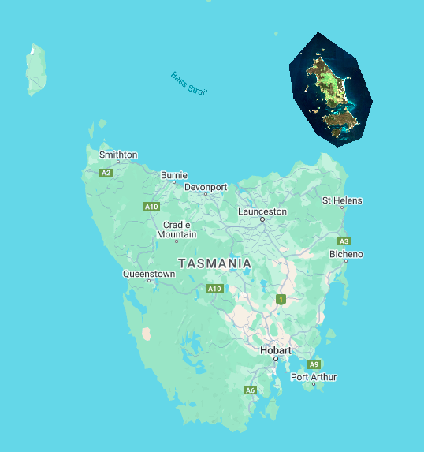
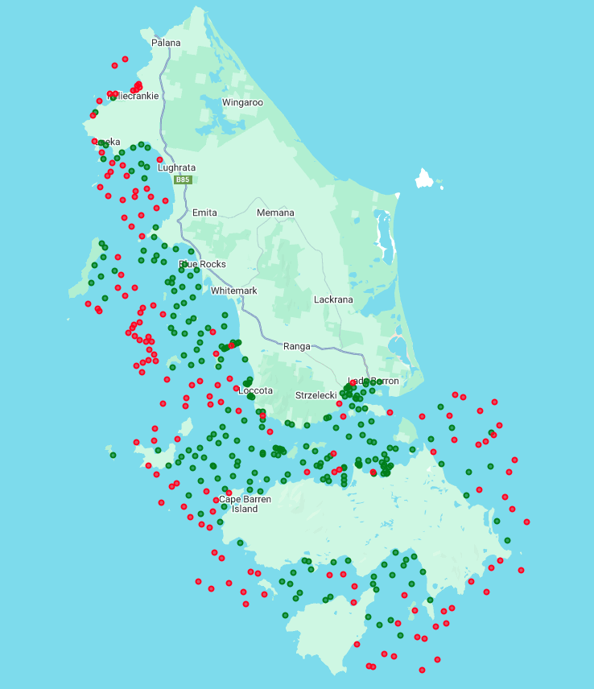
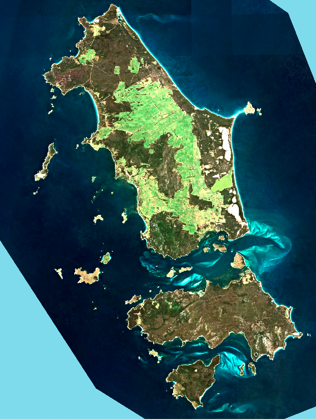
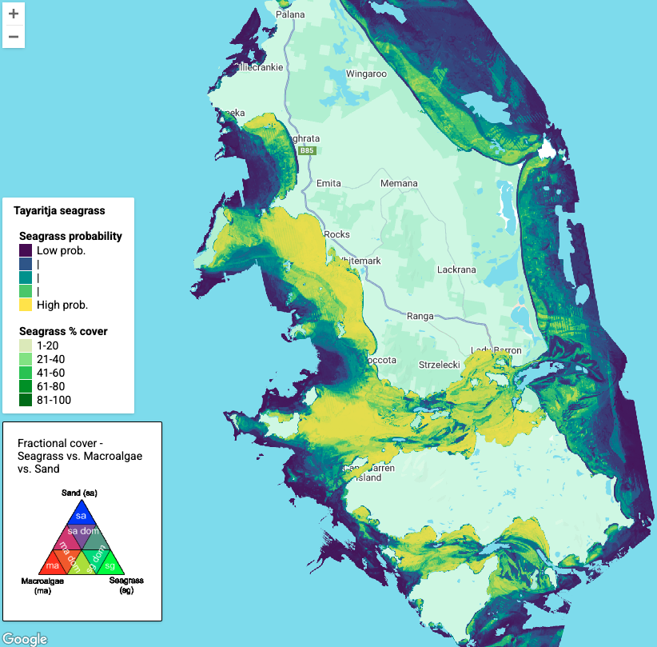
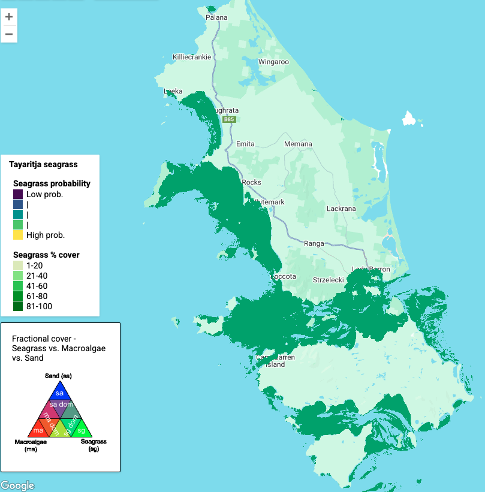
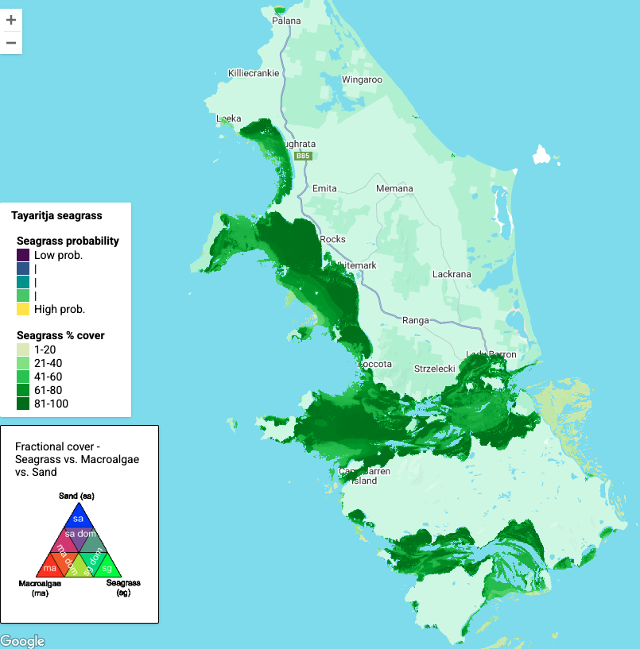
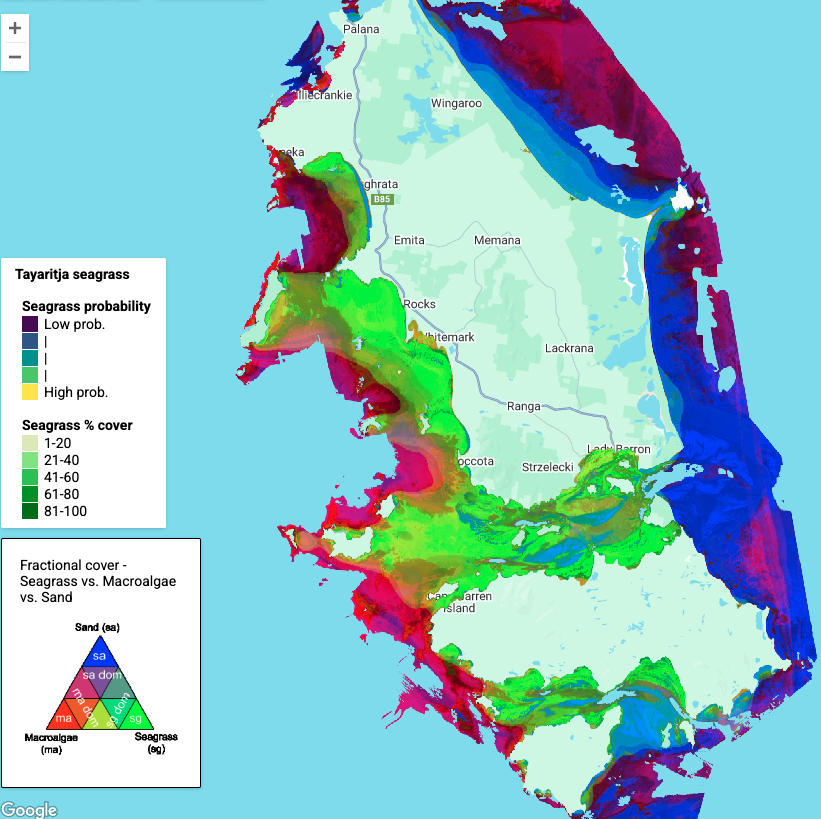
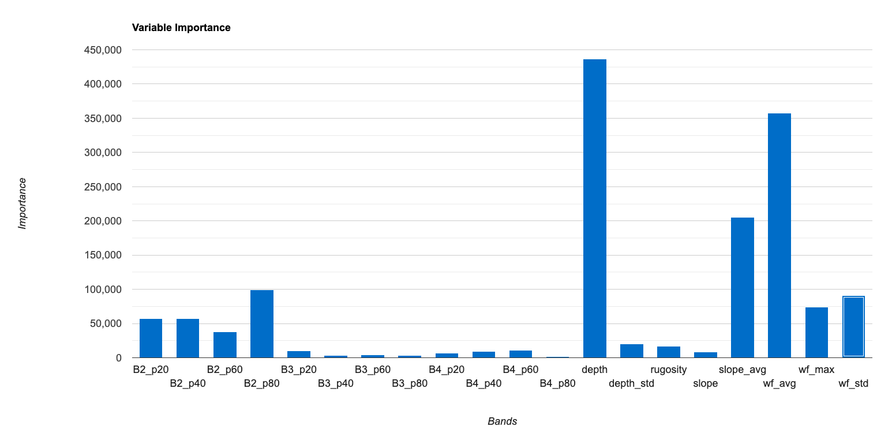

# SOP Case Study Application - Tayaritja (Furneaux Islands) Seagrass Mapping

## 1. Project Overview

This case study demonstrates the application of the Seagrass Mapping SOP to map benthic habitats, with particular focus on seagrass meadows, in the Furneaux Group of Islands (Tayaritja) in north-eastern Tasmania. The project was conducted as part of the National Environmental Science Program (NESP) Marine and Coastal Hub's Project 3.6, which aimed to improve data on the distribution and ecological value of temperate subtidal seagrass in the region.

The Furneaux Group of Islands represents a significant ecological and cultural area, home to extensive seagrass meadows supporting various marine ecosystems. This mapping effort addresses a critical knowledge gap regarding the extent and distribution of coastal seagrass habitats in eastern Bass Strait, which was identified in the NESP Marine and Coastal Hub national wetlands scoping study.

## 2. Study Area

The study area encompasses the western region of the Furneaux Group of Islands, with primary focus on the coastal waters surrounding Flinders Island. The mapped area extends from the coastline at high tide to a depth limit determined by the reliable detection of seagrass features using optical remote sensing techniques (approximately 30 meters in this case). This depth threshold was established through analysis of field data and satellite imagery capabilities in the study region.

  
**Tayaritja Study Area - Sentinel-2 image stack visualised to show the mapping extent constraint for the project**

## 3. Data Sources and Collection

### 3.1 Field Data Collection

Field data collection followed the protocols outlined in Section 4 of the Seagrass Mapping SOP, utilizing a statistically balanced sampling approach that maintained uniform sampling intensity while avoiding preference or exclusion of any areas.

The [Benthic Observation Survey System (BOSS)](https://drop-camera-field-manual.github.io/) was employed for collecting in-situ data, as described in Section 4.3 of the SOP. The BOSS system captures high-resolution panoramic imagery of the seafloor from multiple angles, providing detailed benthic habitat information. The CATAMI classification scheme was used for benthic feature labeling, with points annotated using the Squidle+ platform.

  
**BOSS site locations, showing where seagrass was present (green) and absent (red)**

Field data was processed using the automated export functionality from [SQUIDDLE+](https://squidle.org/), and is publicly available from that platform. The data were exported with the standard naming attributes, as well as the "Seamap Australia" translated label. For additional processing and preparation of field data for mapping applications, we developed an [R script](./boss_raw_processing.R) that handles data cleaning and format standardization, usage parameters and output formats. The processing workflow converts the BOSS raw annotated observation data into a [training and validation dataset](./boss_nesp36_processed.csv) suitable for input into the classification/mapping workflow.

The sampling design focused on capturing the full range of seagrass conditions and depth ranges, from dense beds to sparse coverage, as well as non-seagrass substrates for comparison.

### 3.2 Environmental Data Sources

Following the guidance in Section 4.2 of the SOP, several ancillary data sources were integrated:

**Bathymetry and Derived Products:**
- High-resolution LiDAR bathymetry from surveys conducted for the Australian Hydrographic Office
- Lower-resolution LiDAR and sonar bathymetry to fill gaps in the primary dataset
- Derived products including slope and rugosity at multiple scales, as detailed in Section 4.2.1 of the SOP

**Wave Climate Data:**
- Wave hindcast model from Wavewatch III
- Metrics included average wave power, maximum wave power, and standard deviation
- Data was interpolated to create a uniform grid with appropriate spatial resolution for the study area

### 3.3 Satellite Image Data

**Sentinel-2 Multispectral Imagery:**
- Processing aligned with Section 6.1 of the SOP, creating two distinct multi-temporal stacks:
    - For the baseline habitat occurrence probability layers: all images between 2020-01-01 and 2023-12-31
    - For the habitat benthic % cover layers: all images between 2020-01-01 and 2023-12-31
- Cloud masking using Google Cloud Score Plus
- Composite images were produced using percentile metrics (20th, 40th, 60th, 80th)

  
**Sentinel-2 baseline (2023-2025) Composite**

## 4. Mapping Methodology

### 4.1 Mapping Products

Three key types of mapping products were developed for this project:

1. **Occurrence probability maps**: Continuous probability surfaces (0-100%), modelled from presence/absence data, indicating the likelihood of habitat presence at each pixel for:
    - Seagrass (including all morphologies; > 5% cover in the BOSS field data observations)
    - Macroalgae (species/assemblages as defined in the Seamap schema)
    - Sand (as per the Seamap schema)

2. **Habitat percentage cover maps**: Quantitative estimates of percent cover for each habitat category:
    - Seagrass (including all morphologies)
    - Macroalgae (species/assemblages as defined in the Seamap schema)
    - Sand (as per the Seamap schema)

3. **Derived products**:
    - Baseline seagrass presence/extent - binary maps derived by applying optimized probability thresholds to the occurrence probability layers
    - Fractional cover visualization - combining cover percentages of multiple habitats into a single composite product

These complementary products serve different purposes: probability maps provide confidence information, extent maps offer clear delineation of seagrass boundaries where required, and percent cover maps enable quantitative analysis of seagrass (and other habitat) density patterns. Together, they provide a comprehensive understanding of seagrass distribution across the study area.

### 4.2 Classification Approach

The mapping methodology followed Section 7 of the SOP, opting for gradient boosting machines for their effectiveness with complex environmental data. The models were developed with parameters optimized for the study area, including:
- Number of trees: 1000
- Shrinkage (learning rate): 0.005
- Sampling rate (fraction): 0.6
- Max nodes (depth): 10
- Distribution (Bernoulli for occurrence, Gaussian for % cover)

The classification approach consisted of three main steps:

1. **Probabilistic Classification**: Generation of a continuous probability (from classificaiton trees) surface indicating the likelihood of seagrass (+ macroaglae/sand) presence at each pixel
2. **Habitat percent cover regression**: Generation of continuous percetnage cover estimates (from regression trees) indicating cover of seagrass (+ macroaglae/sand) in each pixel
3. **Threshold Selection and Extent Mapping**: Determination of a probability threshold, combining with information from other modelled productds and manual editing boundaries, to define a _baseline seagrass extent_
4. **Seagrass cover and fractional cover products**: Seagrass percent cover and frational cover products are presented for areas identified within the baseline seagrass extent

### 4.3 Mapping Code

The complete code implementation for this mapping process was implemented in Google Earth Engine, using the JavaScript API and [processed field data above (bathymetry product available on request):
- [**Core mapping code**](./gee_mapping_code.js)
- [**Supporting functions and parameters**](./gee_mapping_code_functions.js)

## 5. Results and Validation

### 5.1 Output Maps

Visual snapshots of the outputs are provided below, but the following full products can be explored and downloaded from [Seamap](https://seamapaustralia.org/map/):
- [Seagrass/Macroalgae/Sand occurence probability layers](Seamap/or/metadata/link)
- [Seagrass/Macroalgae/Sand benthic percentage cover layers (+associated fractional cover visualisation)](Seamap/or/metadata/link)
- [Baseline seagrass extent](Seamap/or/metadata/link)

  
**Seagrass Probability Map - continuous probability surface with values from 0-100%**  

  
**Seagrass Extent Map - binary presence/absence of seagrass after threshold application and manual editing**  

  
**Seagrass Percent Cover Map - continuous estimation of seagrass cover percentage within the mapped extent**  

  
**Seagrass Fractional Cover Map - fractional cover product within the mapped extent**  

### 5.2 Variable Importance

Analysis of variable importance across the classification models reveals the key environmental drivers of seagrass distribution in the study area:

1. **Depth**: Consistently one of the most important predictors, reflecting the fundamental relationship between light availability and seagrass growth

2. **Spectral Information**: Sentinel-2 blue and green bands show high importance, particularly from specific percentile composites that effectively capture seagrass signatures

3. **Wave Exposure**: Wave power metrics significantly contribute to the models, indicating the importance of hydrodynamic conditions for seagrass establishment

4. **Substrate Complexity**: Rugosity metrics at various scales help differentiate suitable seagrass habitat from other benthic environments

  
**Example Variable Importance Chart - Bar chart representing the relative importance of different predictor variables across classification models (for seagrass presence)**

### 5.3 Mapping Validation

The validation process follows the protocols outlined in Section 8 of the SOP, employing a resampling-based approach as described in Lyons et al. (2018). We used a hold-out method with 33% of field data withheld from model training and used exclusively for validation. This process was repeated 1000 times with random partitioning to ensure robust accuracy assessment. A comprehensive [R script](./mapping_validation.R) was developed to peform the validation, which also draws on the provided [covariate pixel drill stack](./boss_nesp36_covariate_drill.csv).

To validate the habitat occurrence probability maps, we converted probabilities to binary presence using a 0.5 threshold. The following accuracy metrics were calculated:

**Table 1: Accuracy Assessment (Overall Accuracy - percentage agreement) for Habitat Occurrence Maps**

| Habitat Type | Overall Accuracy | 95% Confidence Interval |
|--------------|------------------|-------------------------|
| Seagrass     | 0.91             | 0.87-0.92               |
| Macroalgae   | 0.82             | 0.80-0.85               |
| Sand         | 0.91             | 0.90-0.92               |

For the habitat percent cover maps, we calculated Root Mean Square Error (RMSE) between predicted and observed cover values:

**Table 2: RMSE (in percentage cover units) for Habitat Percent Cover Maps**

| Habitat Type | RMSE  | 95% Confidence Interval |
|--------------|-------|-------------------------|
| Seagrass     | 0.22  | 0.21-0.24               |
| Macroalgae   | 0.23  | 0.21-0.24               |
| Sand         | 0.22  | 0.20-0.24               |

These validation results indicate high accuracy for seagrass and sand mapping, with somewhat lower but still acceptable accuracy for macroalgae. The percent cover estimations show consistent performance across all habitat types, with RMSE values indicating that, on average, cover estimates are within 22-23% of field-measured values.

## 6. Operational Considerations

This case study highlights several operational considerations when applying the SOP:

1. **Field Data Requirements**: Sufficient field observations across the full range of seagrass conditions are essential for robust model training and validation

2. **Processing Resources**: Google Earth Engine provides an efficient platform for processing large volumes of satellite data, but certain preprocessing steps (e.g., specialized atmospheric correction) may require additional resources

3. **Threshold Selection**: The choice of probability threshold for the extent map involves trade-offs between commission and omission errors, requiring careful consideration of the specific management needs

4. **Temporal Dynamics**: The multi-temporal approach helps overcome limitations of single-date imagery but requires consideration of potential seasonal variations in seagrass extent

## 7. Future Applications and Refinements

The methodology demonstrated in this case study can be further refined in several ways:

1. **Species-Level Mapping**: The current supplied data and code can generate species maps, but further work is reqwuired to comprehensively explore/validate this work - future versions of the SOP and case studies will handle this.

2. **Temporal Monitoring**: The established workflow could be applied to multiple time periods to assess changes in seagrass distribution over time

3. **Integration with Field Monitoring**: The mapping products could be integrated with ongoing field monitoring programs to provide a comprehensive understanding of seagrass ecosystem health

4. **Specific local mapping requirements**: Several potential future mapping avenues could be explored, that may require additional field or image data. For example, epihitic load on seagrass can be detected by the BOSS data annotation, but further processing and higher reoslution satellite data would be required. Note that the earth engine code supplied is already capable of handling several image data types (Sentinel-2, Landsat, Planet, SPOT, Plaides etc.) as well as all common mapping response varaibles (presence/absence, probability, cover, species etc.).
